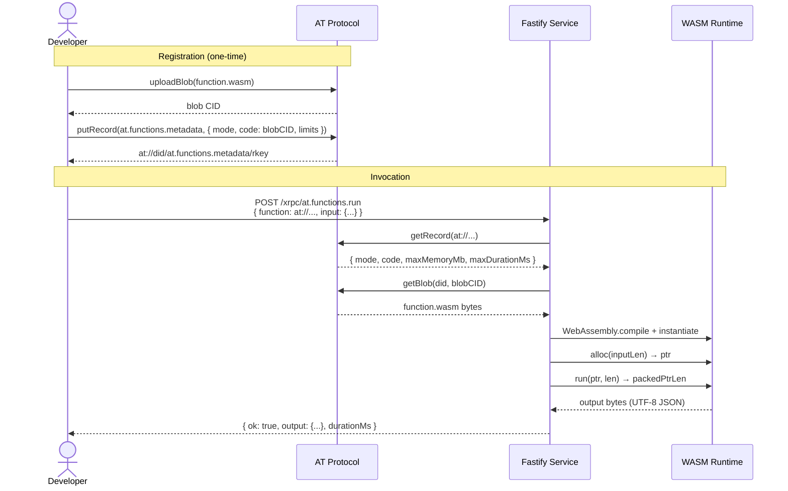
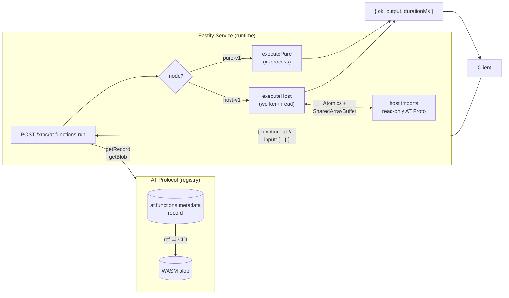

# AT Functions

AT Functions treats the AT Protocol as a code registry and a Fastify service as a WASM execution runtime. Functions are stored as signed records on AT Proto, fetched on demand, and executed in a sandboxed WebAssembly environment.

**pure-v1 / host-v1** — ABI-level execution modes:

[](https://asciinema.org/a/WNxOeLHwd874B1cR)

**component-v1** — WASI Component Model + WIT typed interfaces:

[](https://asciinema.org/a/FRBHPlHE41DAVlVT)





---

## Execution modes

| Mode | WASI | Host I/O | Deterministic |
|------|------|----------|---------------|
| `pure-v1` | ✗ | ✗ | ✓ |
| `host-v1` | ✗ | Read-only AT Proto | mostly ✓ |
| `component-v1` | ✗ | Typed WIT imports | mostly ✓ |

### component-v1

`component-v1` uses the [WASI Component Model](https://component-model.bytecodealliance.org/) and [WIT (WebAssembly Interface Types)](https://github.com/WebAssembly/component-model/blob/main/design/mvp/WIT.md) instead of the raw pointer/length ABI used by `pure-v1` and `host-v1`. It is the long-term direction for AT Functions.

**Why it's better:**
- Typed interfaces defined in WIT — no manual ptr/len packing or JSON envelope wrapping for host calls.
- Language-agnostic: any language with a WIT bindgen (Rust, Go, C, Python, …) can implement the interface.
- The host contract is explicit and machine-verifiable, not just a convention.

**Why WASI filesystem is NOT used:** This is intentional. Only typed AT Proto capabilities (`atfunc:runtime/atproto`) are exposed to the component. No general-purpose WASI interfaces are imported, keeping the sandbox surface minimal.

**Status:** Currently experimental in this POC. jco programmatic transpilation is used at runtime (no ahead-of-time step on the server).

**Requirements:**
- [`wasmtime`](https://wasmtime.dev/) (for local testing / `wasm-tools`)
- [`wasm-tools`](https://github.com/bytecodealliance/wasm-tools) — to wrap a `wasm32-wasip1` binary into a component
- Rust `wasm32-wasip1` target: `rustup target add wasm32-wasip1`

**Compiling the component-rust example:**

```bash
cd examples/component-rust

# Build the core WASM module targeting WASI P1
cargo build --target wasm32-wasip1 --release

# Wrap it into a WASI Component Model component
wasm-tools component new \
  target/wasm32-wasip1/release/component_lister.wasm \
  -o component_lister.component.wasm
```

**Invoking:**

```bash
pnpm exec tsx scripts/invoke.ts \
  --function "at://did:plc:yourDID/at.functions.metadata/component-lister-v1" \
  --input '{"repo":"did:plc:yourDID","collection":"app.bsky.feed.post","limit":5}'
```

### ABI contract (pure-v1 and host-v1)

Your WASM module must export:

```
memory                         — linear memory
alloc(len: i32) -> i32         — allocate len bytes, return ptr
run(ptr: i32, len: i32) -> i64 — execute; packed return: (ptr << 32 | len)
dealloc(ptr: i32, len: i32)    — optional: free output buffer
```

Input/output are UTF-8 JSON. The host calls `alloc(input.len)`, writes input bytes, calls `run(ptr, len)`, then reads `len` output bytes from the returned pointer.

### host-v1 imports

Available under the `"host"` namespace:

```
host_read_record(ptr: i32, len: i32) -> i64
  input:  { atUri: string }
  output: { ok: bool, record?: unknown, cid?: string, error?: string }

host_read_blob(ptr: i32, len: i32) -> i64
  input:  { cid: string, repo?: string }
  output: { ok: bool, mimeType?: string, bytesBase64?: string, error?: string }

host_list_collection(ptr: i32, len: i32) -> i64
  input:  { repo: string, collection: string, cursor?: string, limit?: number }
  output: { ok: bool, records?: [{uri, cid, value}], cursor?: string, error?: string }
```

All host functions are **read-only**. `limit` is clamped to 100.

---

## Project layout

```
at-functions/
├── lexicons/               AT Lexicon definitions
│   ├── at.functions.metadata.json
│   └── at.functions.run.json
├── src/
│   ├── server.ts           Fastify entry point
│   ├── routes/run.ts       POST /xrpc/at.functions.run
│   ├── lib/
│   │   ├── atproto.ts      AT Proto SDK helpers
│   │   ├── schemas.ts      JSON Schema for Fastify validation
│   │   └── types.ts        TypeScript types
│   └── wasm/
│       ├── abi.ts          ptr/len packing, memory I/O helpers
│       ├── executePure.ts  pure-v1 executor
│       ├── executeHost.ts  host-v1 executor (worker thread coordinator)
│       ├── hostWorker.mjs  worker thread: runs WASM, uses Atomics.wait
│       ├── hostImports.ts  (reference) host import implementations
│       └── moduleCache.ts  CID → compiled WebAssembly.Module cache
├── examples/
│   ├── pure-rust/          Echo function (pure-v1)
│   └── host-rust/          Collection lister (host-v1)
└── scripts/
    ├── upload-function.ts
    ├── create-function-record.ts
    └── invoke.ts
```

---

## Setup

### Prerequisites

- Node.js 22+
- pnpm 10+ (or `corepack enable`)
- [Rust + wasm32-unknown-unknown target](https://www.rust-lang.org/tools/install) (for Rust examples)
- A Bluesky / AT Proto account + app password (for uploading functions)

### Install

```bash
pnpm install
```

### Environment

```bash
cp .env.example .env
# Fill in ATPROTO_IDENTIFIER and ATPROTO_PASSWORD
```

### Run the server

```bash
pnpm run dev          # development (watch)
pnpm run build && pnpm start   # production
```

The server starts on `http://localhost:3000`.

---

## Compiling Rust examples to WASM

Both examples target `wasm32-unknown-unknown` (no WASI, no std I/O).

```bash
# Install the target once
rustup target add wasm32-unknown-unknown

# Compile pure echo example
cd examples/pure-rust
cargo build --target wasm32-unknown-unknown --release
# Output: target/wasm32-unknown-unknown/release/pure_echo.wasm

# Compile host lister example
cd examples/host-rust
cargo build --target wasm32-unknown-unknown --release
# Output: target/wasm32-unknown-unknown/release/host_lister.wasm
```

---

## End-to-end walkthrough

### 1. Upload the WASM blob

```bash
ATPROTO_IDENTIFIER=you.bsky.social ATPROTO_PASSWORD=your-app-password \
  pnpm exec tsx scripts/upload-function.ts \
    examples/pure-rust/target/wasm32-unknown-unknown/release/pure_echo.wasm
```

Note the blob JSON printed at the end — you'll use it in the next step.

### 2. Register the function record

```bash
ATPROTO_IDENTIFIER=you.bsky.social ATPROTO_PASSWORD=your-app-password \
  pnpm exec tsx scripts/create-function-record.ts \
    --name "echo" \
    --version "0.1.0" \
    --mode "pure-v1" \
    --rkey "echo-v1" \
    --blob '{"$type":"blob","ref":{"$link":"bafk..."},"mimeType":"application/wasm","size":12345}'
```

This creates an `at.functions.metadata` record on your AT Proto repo.
The script prints the `at://` URI for the record.

### 3. Invoke the function

```bash
# Start the server first (in another terminal):
pnpm run dev

# Then invoke:
pnpm exec tsx scripts/invoke.ts \
  --function "at://did:plc:yourDID/at.functions.metadata/echo-v1" \
  --input '{"hello":"world","num":42}'
```

Expected response:
```json
{
  "ok": true,
  "output": { "ok": true, "echo": { "hello": "world", "num": 42 }, "mode": "pure-v1" },
  "durationMs": 12,
  "functionCid": "bafy..."
}
```

### 4. Host example (host-v1)

Upload and register `host_lister.wasm` with `--mode "host-v1"`, then invoke:

```bash
pnpm exec tsx scripts/invoke.ts \
  --function "at://did:plc:yourDID/at.functions.metadata/lister-v1" \
  --input '{"repo":"did:plc:yourDID","collection":"app.bsky.feed.post","limit":5}'
```

Expected response:
```json
{
  "ok": true,
  "output": { "ok": true, "count": 5, "uris": ["at://..."], "collection": "app.bsky.feed.post" },
  "durationMs": 340
}
```

---

## API

### `POST /xrpc/at.functions.run`

**Request body:**
```json
{
  "function": "at://did:plc:.../at.functions.metadata/my-fn",
  "input": { "any": "json" }
}
```

**Response:**
```json
{
  "ok": true,
  "output": { "...": "..." },
  "durationMs": 45,
  "functionCid": "bafy..."
}
```

On failure: `ok: false, error: "reason"`.

---

## Tests

```bash
pnpm test
```

Tests cover:
- AT URI parsing
- `packPtrLen` / `unpackPtrLen`
- `callWasmFunction` with fake exports
- Host import ABI contract

---

## Security notes

**This POC is NOT production-safe:**

- WASM runs in-process with no OS-level isolation
- `maxMemoryMb` is enforced via initial page count only; the module can request more via `memory.grow`
- `maxDurationMs` uses `Promise.race` with `setTimeout` — the WASM may continue running briefly after timeout
- No authentication or authorisation on the `/xrpc/at.functions.run` endpoint
- `host-v1` functions can read any public AT Proto data

For production: use a separate process, seccomp/landlock/VM isolation, and proper memory limits enforced at the V8/Wasm engine level.

---

## How it works (architecture)

```
POST /xrpc/at.functions.run
  │
  ├─ parseAtUri(at://...)
  ├─ fetchFunctionRecord → AT Proto getRecord
  ├─ fetchBlob → AT Proto sync.getBlob
  │
  ├─ pure-v1 ──────────────────────────────────────────────┐
  │    WebAssembly.compile(wasmBytes)                       │
  │    WebAssembly.instantiate(module, {})                  │
  │    alloc(inputLen) → ptr                                │
  │    write input bytes → memory[ptr]                      │
  │    run(ptr, len) → packed i64                           │
  │    unpack → outPtr, outLen                              │
  │    decode memory[outPtr..outPtr+outLen] → JSON          │
  │                                                         │
  └─ host-v1 ──────────────────────────────────────────────┘
       Main thread spawns Worker (hostWorker.mjs)
       Worker instantiates WASM with host imports
       Host import → Atomics.wait (blocks worker thread)
       Main thread event loop picks up host request
       Main thread → AT Proto async I/O
       Main thread writes response → SharedArrayBuffer
       Atomics.notify → worker unblocks
       Worker reads response, continues execution
       Worker sends final output → parentPort.postMessage
       Main thread resolves Promise → JSON response
```

---

## Lexicon definitions

See [`lexicons/at.functions.metadata.json`](lexicons/at.functions.metadata.json) and [`lexicons/at.functions.run.json`](lexicons/at.functions.run.json).

---

## POC disclaimer

This project demonstrates the concept of AT Protocol as a code registry. It is not:

- A production runtime
- A secure sandbox
- A multi-tenant system
- WASI-compatible

It is a proof of concept to explore the idea and invite further discussion.
